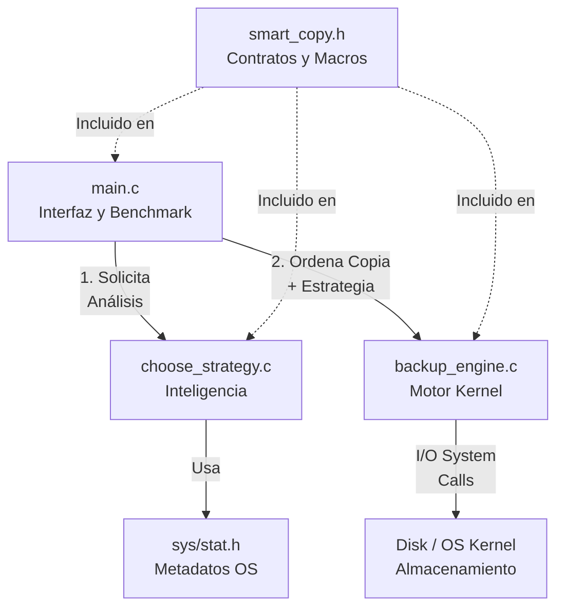

# Documento de Arquitectura: SmartBackup 

## 1. Objetivo del Sistema
**SmartBackup** resuelve el problema de la ineficiencia en los sistemas de respaldo de archivos tradicionales. Su objetivo principal es realizar copias de seguridad inteligentes mediante:
1. **Detección de cambios:** Evitando reescribir archivos que no han sido modificados (comparación de metadatos/tamaño).
2. **Optimización de capas (Layer Optimization):** Seleccionando dinámicamente si el archivo debe copiarse a través del Espacio de Usuario (librerías estándar de C con `stdio.h`) o directamente en el Espacio del Kernel (mediante Syscalls como `read`/`write` con buffers optimizados de 4KB o 64KB), maximizando así el *throughput* y reduciendo los cuellos de botella por *Context Switching*.

**Alcance y limitaciones:**
* Diseñado específicamente para entornos UNIX/Linux (o WSL en Windows).
* Funciona a nivel de un solo nodo (almacenamiento local).
* La detección de cambios se basa actualmente en el tamaño del archivo (`st_size`), asumiendo que una modificación altera este valor.

## 2. Visión General
El sistema opera bajo una arquitectura modular donde la interfaz de usuario, la toma de decisiones y la ejecución de bajo nivel están estrictamente separadas. 
* **Flujo básico:** El usuario (o sistema automatizado) solicita un respaldo -> El sistema valida si es necesario (tamaño) -> El evaluador de estrategia mide el archivo y decide la ruta óptima -> El motor de backup ejecuta la copia -> Se registra la actividad y se liberan los recursos.

## 3. Componentes Principales

* **`src/main.c`**: Es el punto de entrada del programa. Maneja la interfaz de usuario (menú interactivo), recolecta las rutas de origen/destino y realiza las llamadas a los demás módulos. También aloja el benchmark (medición de tiempos).
* **`src/backup_engine.c`**: Contiene la lógica de bajo nivel (*Kernel Engine*). Implementa la seudofunción `sys_smart_copy`, manejando descriptores de archivo, buffers dinámicos, `errno` y el cierre seguro de recursos.
* **`src/choose_strategy.c`**: Es el organizador o el cerebro del sistema (*Arquitecto*). Analiza los metadatos de los archivos mediante `stat()` para decidir si se omite el backup (`needs_backup`) y qué estrategia de copia usar (`choose_strategy`).
* **`include/smart_copy.h`**: El contrato del sistema. Define las firmas de las funciones, las macros de configuración y los umbrales de tamaño (ej. `THRESHOLD_SMALL` de 1MB).
* **`bin/SmartBackup`**: El ejecutable binario final generado tras la compilación por el Makefile.
* **`tests/`**: Scripts de automatización en Bash (`bench_1kb.sh`, `bench_1mb.sh`, `bench_1gb.sh`) para realizar pruebas rápidas y rendimiento aisladas.

## 4. Dependencias Externas
* **Compilador:** `gcc` con soporte para estándar C11 (`-std=c11`).
* **Librerías POSIX:** Uso de `-D_POSIX_C_SOURCE=199309L` para acceso a estructuras y funciones avanzadas del sistema operativo.
* **Librería de Tiempo (`librt`):** Uso de la bandera `-lrt` en el Makefile para enlazar la librería de *Real-Time* necesaria para mediciones de reloj de alta precisión (`clock_gettime`).
* **Entorno:** Requiere un kernel Linux (WSL) debido al uso de llamadas directas al sistema como `open()`, `read()`, `write()`, y funciones como `stat()`.

## 5. Patrones de Diseño y Decisiones Clave
* **Modularidad:** Se dividió la lógica en múltiples archivos `.c` para separar la interfaz (`main`), la toma de decisiones (`choose_strategy`) y la interacción con el SO (`backup_engine`). Esto facilita el mantenimiento y previene el "código espagueti".
* **Estrategias de Optimización:**
  * Archivos < 1MB: Se delegan a `User Space` porque el buffering interno de `stdio.h` es suficientemente rápido.
  * Archivos 1MB - 100MB: Se envían a `Kernel Space` con un buffer que empareja el tamaño de página de la memoria virtual (4096 bytes / 4KB) para alinear operaciones de I/O.
  * Archivos > 100MB: Se envían a `Kernel Space` usando un "Chunk Buffer" enorme (64KB) para saturar el bus de disco y minimizar drásticamente los *Context Switches*.
* **Evaluación de Cortocircuito:** Antes de abrir descriptores de archivo costosos, se verifica `stat().st_size`. Si el origen y destino miden lo mismo, la operación de I/O de escritura se cancela inmediatamente.

## 6. Diagramas

### Arquitectura Lógica (Módulos generales)

### Arquitectura Física (Estructura de los directorios)
```text
smart_backup/
├── bin/
│   └── Adaptguard            (Ejecutable final)
├── docs/
│   ├── ARCHITECTURE.md       (Este documento)
│   └── reporte.pdf           (Análisis de rendimiento)
├── include/
│   ├── menu.h                (Definición de funciones a usar en el menú)
│   └── smart_copy.h          (Cabeceras)
├── src/
│   ├── main.c                (Capa de Usuario / Interfaz)
│   ├── choose_strategy.c     (Lógica de decisión)
│   ├── menu.c                (Implementación de las funciones del menú)
│   └── backup_engine.c       (Capa de Kernel simulada)
├── tests/
│   ├── bench_1gb.sh          (Scripts de prueba)
│   ├── bench_1kb.sh
│   └── bench_1mb.sh 
└── Makefile                  (Orquestador de compilación)
```

## Flujo de datos

Diagrama de secuencia:


### Igualdades:
    - U: Usuario
    - M: Main
    - S: Strategy
    - B: Backup Engine
    - SO: Sistema Operativo
### Flujo:
```text
    U->>M: Selecciona archivo a respaldar
    M->>S: needs_backup(src, dst)
    S->>OS: stat(archivos)
    OS-->>S: Tamaños
    S-->>M: true (Necesita backup)
    M->>S: choose_strategy(src)
    S-->>M: Retorna STRATEGY_KERNEL_4KB
    M->>B: sys_smart_copy(src, dst, STRATEGY_KERNEL_4KB)
    B->>OS: open(), malloc(4096)
    loop Lectura/Escritura
        B->>OS: read(4KB)
        B->>OS: write(4KB)
    end
    B->>OS: close(), free()
    B-->>M: COPY_OK
    M-->>U: "Backup exitoso"
```
